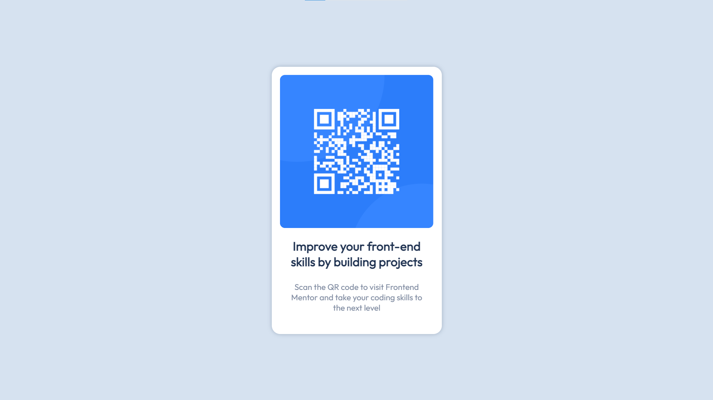
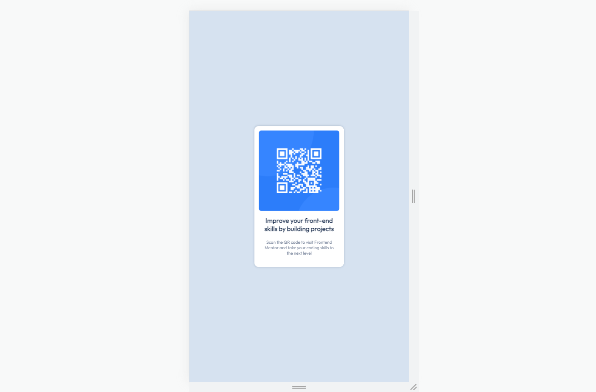

# Frontend Mentor - QR code component solution

This is a solution to the [QR code component challenge on Frontend Mentor](https://www.frontendmentor.io/challenges/qr-code-component-iux_sIO_H).

## Table of contents

- [Frontend Mentor - QR code component solution](#frontend-mentor---qr-code-component-solution)
  - [Table of contents](#table-of-contents)
  - [Overview](#overview)
    - [Screenshots](#screenshots)
  - [My process](#my-process)
    - [Built with](#built-with)
    - [What I learned](#what-i-learned)
  - [Author](#author)

## Overview

### Screenshots




## My process

### Built with

- HTML5
- CSS

### What I learned

After learning some basic concepts, I decided to take some practice by creating a little project using actual tasks. The most difficult part was to move the object to the center of the screen; I lost about half the time to find ways and implement them into my solution.

For the final solution I left this code: 

```css
position: fixed;
top: 50%;
left: 50%;
transform: translate(-50%, -50%);
```
This task took 2 hours to complete instead of the expected 0.5.

## Author

- Frontend Mentor - [@Psinyan](https://www.frontendmentor.io/profile/Psinyan)
- Telegram - [@PaNikAttak](https://t.me/PaNikAttak)
